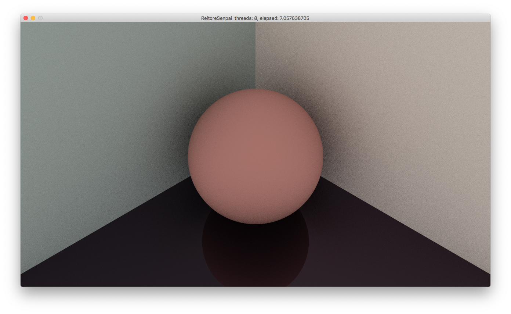

レイトレ先輩
======
ReitoreSenpai

Rustで光線追跡によりヤジュウ先輩を描く。

## Build
```bash
cargo build --release
```

## Run
```bash
./target/release/ReitoreSenpai
```

## Senpai
```bash
out.png
```


## Reference
- Ray Tracing in One Weekend
